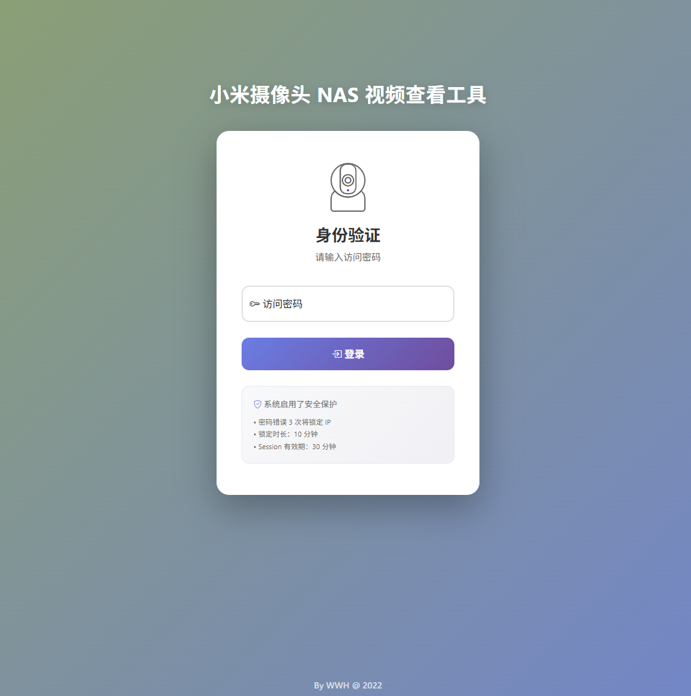
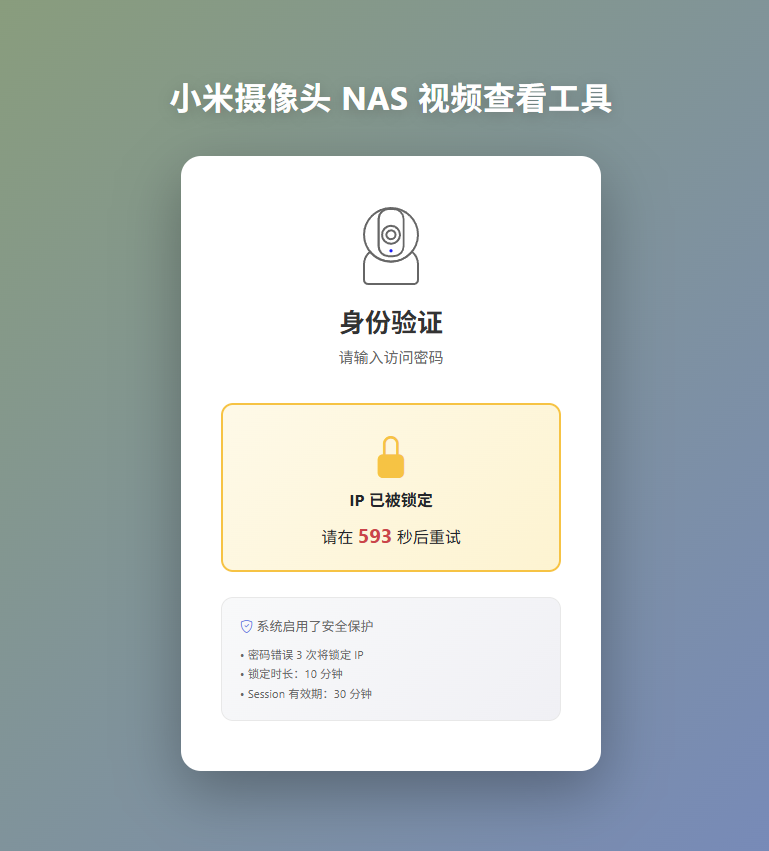
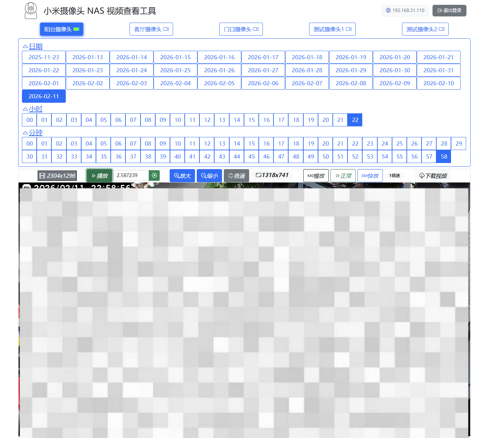
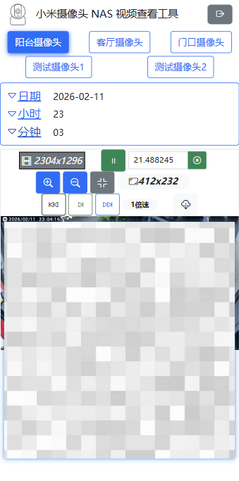

# 小米摄像头 NAS 视频查看工具

## 项目简介

这是一个用于查看存储在 NAS 服务器上的小米摄像头录像的 Web 应用工具。

> 摄像头NAS存储设置
> 进入米家 -> 点击小米摄像头 -> 存储设置 -> NAS网络存储

## 系统界面截图

### 登录界面

#### 登录失败时


### 主页面

#### 移动端主页面



## 功能特性
- 摄像头列表配置（通过配置文件）
- 按日期/小时/分钟浏览视频
- 视频在线播放、下载
- 播放速度控制、逐帧播放、画面缩放
- 密码保护、IP 锁定机制
- 移动端适配

## 快速开始

### 1. 下载并解压

从 [GitHub Releases](../../releases) 下载最新版本的压缩包（tar/zip），解压到任意目录。

### 2. 挂载 NAS 视频

将 NAS 中的小米摄像头视频目录挂载到运行本程序的机器上，确保程序能正常读取视频文件。

### 3. 修改配置

编辑解压目录中的 `application.yml` 文件，配置以下内容：

```yaml
# 摄像头视频配置
camera:
  # 视频文件存储基础路径（NAS 路径）
  base-path: H:\监控\xiaomi_camera_videos

  # 摄像头列表配置
  cameras:
    - name: 门口摄像头
      code: 303abc123456
      enabled: true
    - name: 客厅摄像头
      code: 1bc487654321
      enabled: true

# 安全配置
security:
  # 访问密码（请修改为强密码）
  password: admin123
```

**⚠️ 安全提示**：务必修改默认密码，建议使用强密码（包含大小写字母、数字、特殊字符）。

### 4. 启动程序

- **Windows**: 双击运行 `start.bat`
- **Linux**: 执行 `./start.sh`

### 5. 访问应用

浏览器访问 `http://localhost:8866`，输入配置的密码即可使用。

---

## 视频文件结构

```
H:\监控\xiaomi_camera_videos\
├── 303abc123456\
│   ├── 2024121817\
│   │   ├── 00M18S_1768057218.mp4
│   │   └── 01M18S_1768057278.mp4
│   └── 2024121818\
└── 1bc487654321\
```

摄像头代码可在 NAS 存储目录中找到，格式为 `303abc123456`、`607XXXXXXXXX` 等。

## 注意事项

- 确保 NAS 路径有正确的读取权限
- 视频文件名格式：`{分钟}M{秒}S_{时间戳}.mp4`，例如 `00M18S_1768057218.mp4`
- H.265 编码视频需要较新浏览器支持
- 首次使用请务必修改默认密码
- 建议使用 Chrome、Edge、Firefox 等现代浏览器
